# Cross-Chain Arbitrage Bot: USDCx on Stacks

[](https://opensource.org/licenses/MIT)
[](https://www.typescriptlang.org/)
[](https://nodejs.org/)
[](https://reactjs.org/)
[]()

> **🚀 Production-ready cross-chain arbitrage bot** that automatically detects and executes profitable trading opportunities between Ethereum and Stacks blockchains using USDC/USDCx. Features real-time price monitoring, intelligent opportunity detection, automated execution, and comprehensive risk management.

**Key Highlights:**
- ⚡ **Sub-second price monitoring** across 6+ DEXs
- 🤖 **Automated execution** with intelligent risk management
- 🌉 **Circle xReserve bridge** integration
- 📊 **Real-time dashboard** with analytics
- 🛡️ **Production-grade** security and error handling

### Project Status

| Component | Status | Notes |
|-----------|--------|-------|
| Core Engine | ✅ Production Ready | Fully functional arbitrage engine |
| Bridge Integration | ✅ Production Ready | Circle xReserve fully integrated |
| Frontend Dashboard | ✅ Production Ready | React dashboard with real-time updates |
| Smart Contracts | ✅ Deployed | Contracts on both Ethereum and Stacks |
| API | ✅ Production Ready | RESTful API with comprehensive endpoints |
| Documentation | ✅ Complete | Comprehensive docs and guides |
| Testing | 🟡 In Progress | Core functionality tested, expanding coverage |
| WebSocket Support | 🔜 Planned | Real-time updates via WebSocket |

## Table of Contents

- [Overview](#overview)
- [Features](#features)
- [Architecture](#architecture)
- [Technology Stack](#technology-stack)
- [Installation](#installation)
- [Configuration](#configuration)
- [Usage](#usage)
- [API Documentation](#api-documentation)
- [Smart Contracts](#smart-contracts)
- [Arbitrage Strategy](#arbitrage-strategy)
- [Risk Management](#risk-management)
- [Performance Metrics](#performance-metrics)
- [Security](#security)
- [Deployment](#deployment)
- [Monitoring](#monitoring)
- [Troubleshooting](#troubleshooting)
- [Contributing](#contributing)
- [License](#license)

## 📖 Overview

The Cross-Chain Arbitrage Bot is an automated trading system designed to capitalize on price differences for USDC/USDCx tokens across Ethereum and Stacks blockchains. The bot continuously monitors prices on multiple DEXs, calculates potential profits after accounting for all transaction costs, and executes trades when opportunities meet profitability thresholds.

### Key Capabilities

- **Real-Time Price Monitoring**: Sub-second price updates from multiple DEXs on both chains
- **Intelligent Opportunity Detection**: Advanced algorithms to identify profitable arbitrage opportunities
- **Automated Execution**: Seamless cross-chain trade execution with minimal manual intervention
- **Risk Management**: Comprehensive safeguards including position limits, slippage protection, and circuit breakers
- **Bridge Integration**: Native integration with Circle xReserve for secure cross-chain transfers
- **Performance Analytics**: Real-time tracking of profits, win rates, and execution metrics

### Market Context

Cross-chain arbitrage has emerged as a significant opportunity in the DeFi ecosystem. As different blockchain networks develop their own DeFi protocols, price discrepancies naturally occur due to:

- Varying liquidity pools across chains
- Different market participants and trading volumes
- Network-specific transaction costs and speeds
- Bridge settlement times creating temporary price differences

This bot is specifically optimized for the Ethereum-Stacks bridge, leveraging Circle's xReserve protocol for secure, fast cross-chain transfers of USDC/USDCx.

## 🚀 Quick Start

Get up and running in 5 minutes:

```bash
# 1. Clone the repository
git clone https://github.com/yourusername/programming-usdcx-on-stacks-cross-chain-arbitrage-bot.git
cd programming-usdcx-on-stacks-cross-chain-arbitrage-bot

# 2. Install dependencies
cd backend && npm install
cd ../ && npm install

# 3. Set up environment variables
cd backend
cp .env.example .env
# Edit .env with your configuration (see Configuration section)

# 4. Start services with Docker (recommended)
docker-compose up -d

# Or start manually:
# Terminal 1: Backend
cd backend && npm run dev

# Terminal 2: Frontend
npm run dev
```

**Next Steps:**
1. Configure your `.env` file with blockchain RPC URLs and private keys
2. Visit `http://localhost:5173` to access the dashboard
3. Check API health: `http://localhost:3001/api/health`
4. Start the bot: `POST http://localhost:3001/api/bot/start`

**Example API Call:**
```bash
# Check bot status
curl http://localhost:3001/api/bot/status

# Start the bot
curl -X POST http://localhost:3001/api/bot/start

# View opportunities
curl http://localhost:3001/api/opportunities
```

> ⚠️ **Important**: Never commit private keys or sensitive credentials. Use environment variables or a secrets manager in production.

## ✨ Features

### Core Features

1. **Multi-DEX Price Aggregation**
   - Ethereum: Uniswap V3, Curve, Balancer
   - Stacks: ALEX, Arkadiko, Lydian
   - Weighted price calculation based on liquidity and confidence scores

2. **Advanced Opportunity Detection**
   - Real-time spread calculation
   - Cost estimation including gas, bridge fees, and slippage
   - Risk-adjusted profit ranking
   - Confidence scoring based on data quality

3. **Automated Trade Execution**
   - Multi-step transaction sequencing
   - Gas price optimization
   - Slippage protection
   - Concurrent trade management (up to 3 simultaneous trades)

4. **Circle xReserve Bridge Integration**
   - Automated deposit/withdrawal flows
   - Real-time bridge status monitoring
   - Queue management and optimal timing
   - Attestation handling

5. **Comprehensive Risk Management**
   - Position sizing based on liquidity
   - Maximum exposure limits ($10k per trade, $50k daily)
   - Circuit breakers for anomaly detection
   - Pre-execution price validation

6. **Real-Time Dashboard**
   - Live opportunity monitoring
   - Trade history and analytics
   - Performance metrics visualization
   - System health monitoring

### Advanced Features

- **Smart Contract Integration**: Deployed contracts on both Ethereum and Stacks
- **Error Recovery**: Automatic retry logic with exponential backoff
- **Structured Logging**: Comprehensive logging with Winston
- **Metrics Export**: Prometheus-compatible metrics endpoint
- **WebSocket Support**: Real-time updates for frontend (planned)

## 🏗️ Architecture

### System Architecture Diagram

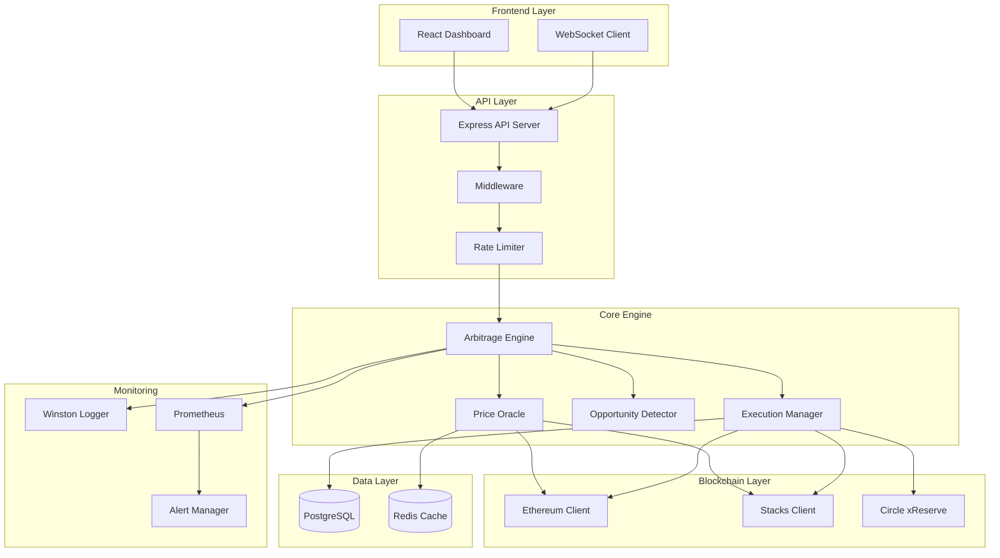

### Component Interaction Flow

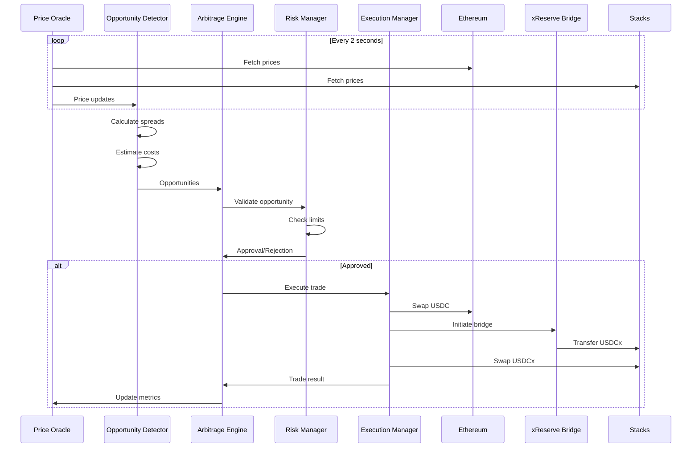

### Data Flow Architecture

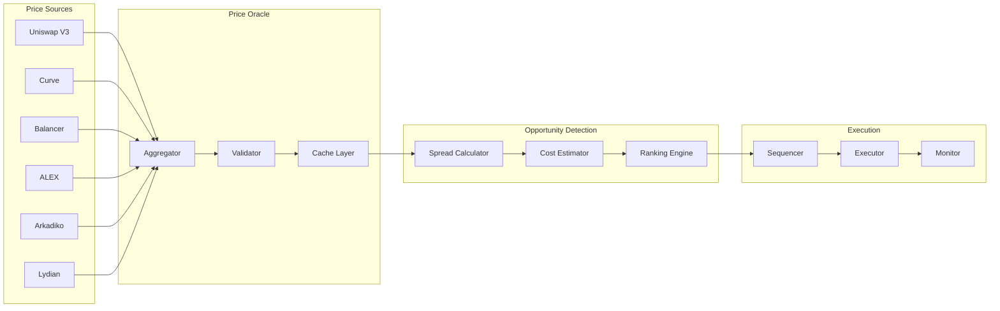

### Arbitrage Execution Flow

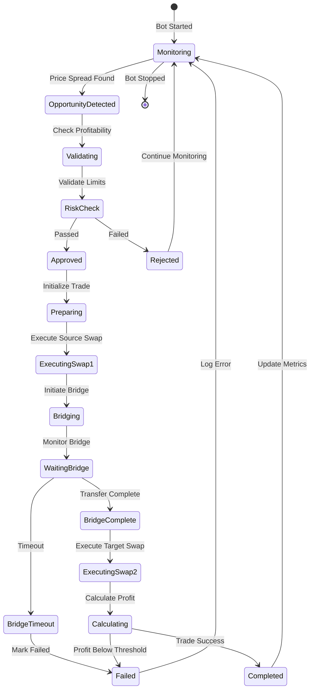

### Bridge Integration Flow

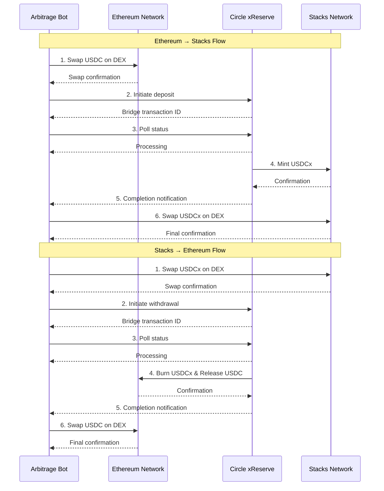

### Database Schema

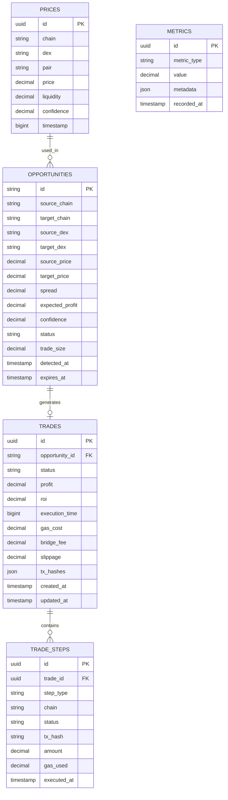

### API Request/Response Flow

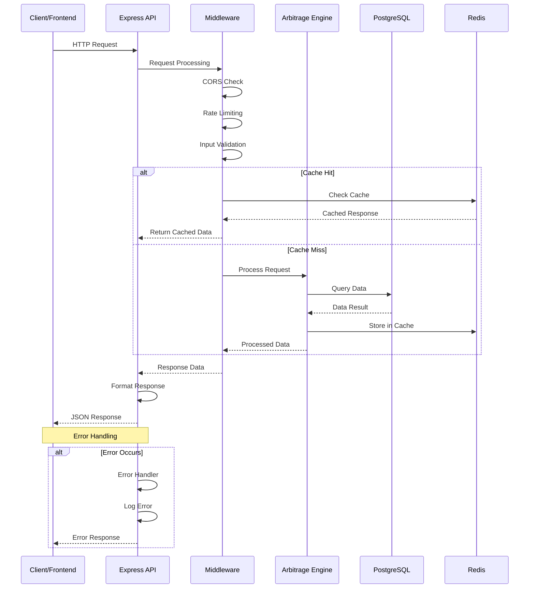

### Error Handling & Retry Logic Flow

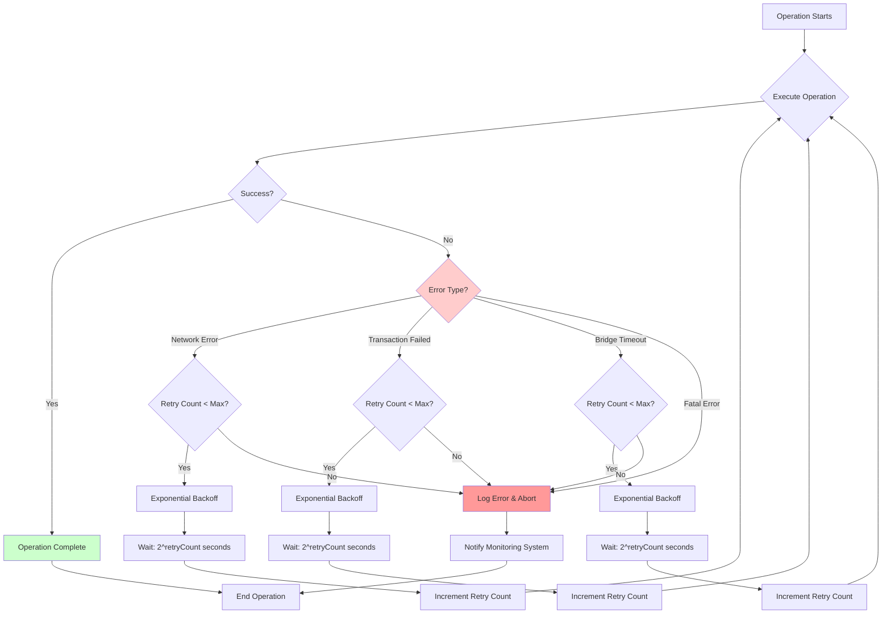

### Security Architecture

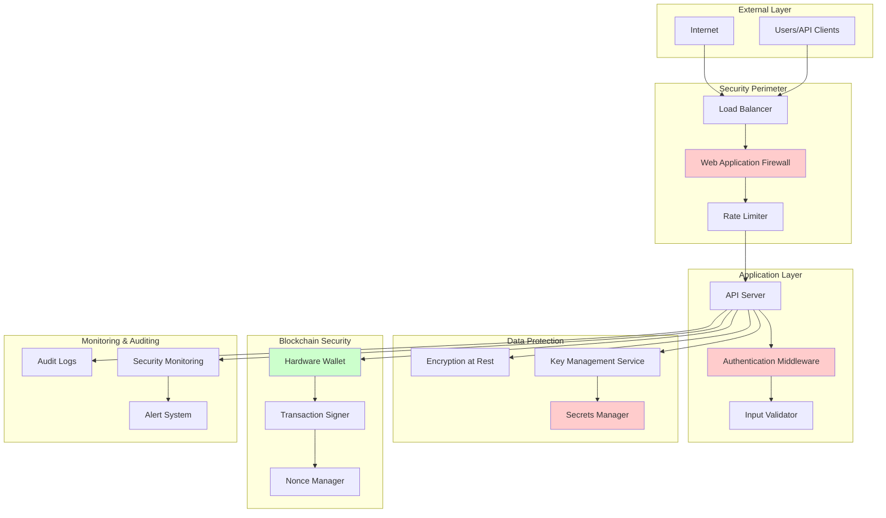

### Deployment Architecture

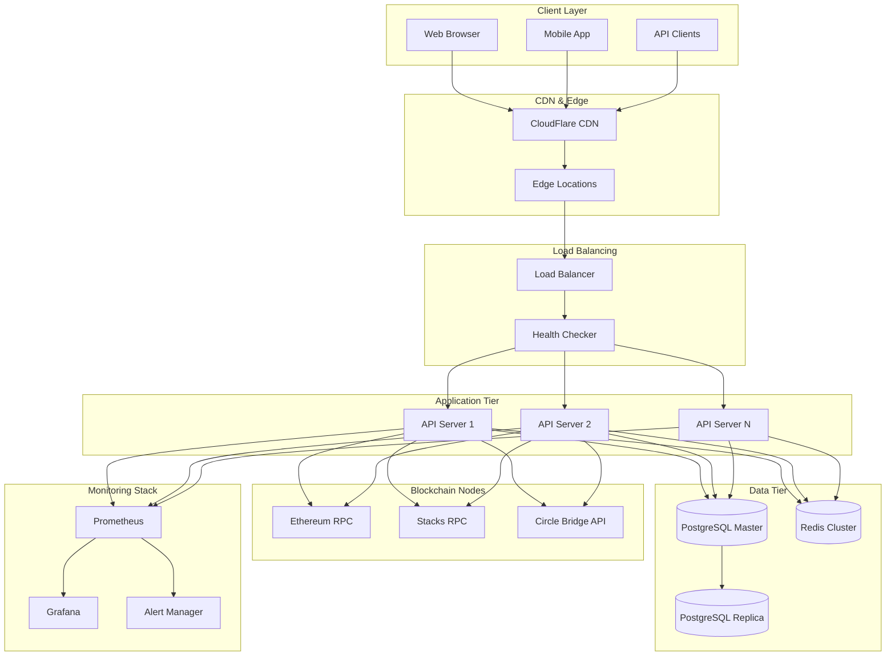

### Price Aggregation Algorithm Flow

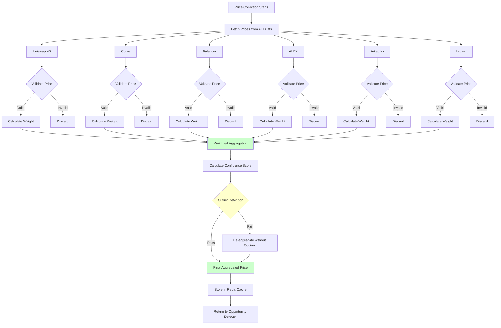

### Risk Management Decision Tree

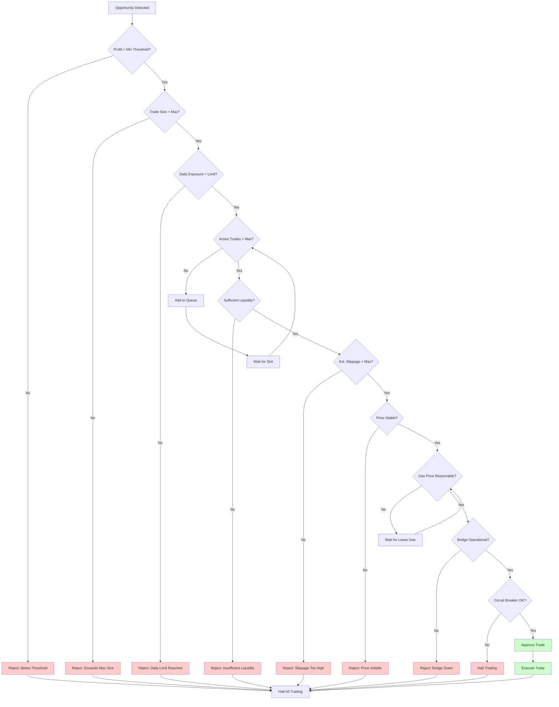

### Network Topology

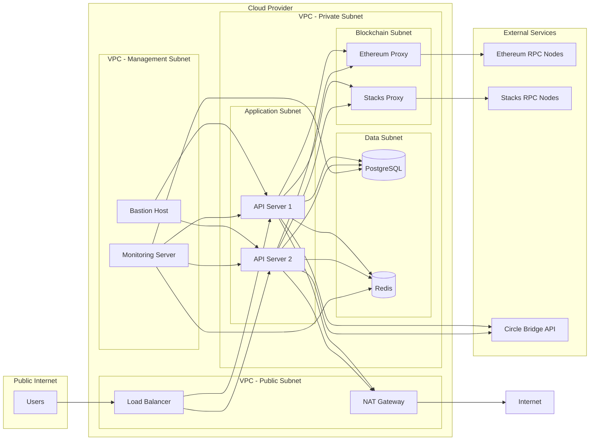

## 💻 Technology Stack

### Backend

- **Runtime**: Node.js 18+
- **Language**: TypeScript 5.8
- **Framework**: Express.js 4.18
- **Database**: PostgreSQL (trade history, analytics)
- **Cache**: Redis (price data, state management)
- **Blockchain Libraries**:
  - `ethers.js` v6.8 (Ethereum)
  - `@stacks/transactions` v6.3 (Stacks)
- **HTTP Client**: Axios 1.6
- **Logging**: Winston (structured logging)
- **Validation**: Zod (runtime type validation)

### Frontend

- **Framework**: React 18.3
- **Build Tool**: Vite 5.4
- **UI Library**: shadcn/ui (Radix UI components)
- **Styling**: Tailwind CSS 3.4
- **State Management**: TanStack Query 5.8
- **Routing**: React Router 6.3
- **Charts**: Recharts 2.15
- **Animations**: Framer Motion 12.27

### Smart Contracts

- **Ethereum**: Solidity 0.8.19
  - OpenZeppelin Contracts (security standards)
  - Hardhat/Foundry for development
- **Stacks**: Clarity
  - Stacks.js for interaction
  - Clarinet for testing

### Infrastructure

- **Containerization**: Docker
- **Orchestration**: Docker Compose
- **Monitoring**: Prometheus + Grafana
- **Error Tracking**: Sentry (optional)

## 📦 Installation

### Prerequisites

- Node.js 18.0 or higher
- PostgreSQL 14+ (for production)
- Redis 6+ (for caching)
- Git
- npm or yarn package manager

### Step 1: Clone Repository

```bash
git clone https://github.com/yourusername/programming-usdcx-on-stacks-cross-chain-arbitrage-bot.git
cd programming-usdcx-on-stacks-cross-chain-arbitrage-bot
```

### Step 2: Install Dependencies

#### Backend

```bash
cd backend
npm install
```

#### Frontend

```bash
cd ..
npm install
```

### Step 3: Environment Configuration

Create a `.env` file in the `backend` directory:

```bash
cd backend
cp .env.example .env
```

Edit `.env` with your configuration:

```env
# Node Environment
NODE_ENV=development

# API Configuration
API_PORT=3001
API_HOST=localhost
CORS_ORIGIN=http://localhost:5173

# Ethereum Configuration
ETH_RPC_URL=https://eth-mainnet.g.alchemy.com/v2/YOUR_API_KEY
ETH_PRIVATE_KEY=your_ethereum_private_key
ETH_CHAIN_ID=1

# Stacks Configuration
STACKS_NODE_URL=https://api.hiro.so
STACKS_PRIVATE_KEY=your_stacks_private_key
STACKS_NETWORK=mainnet

# Circle xReserve Bridge
CIRCLE_API_KEY=your_circle_api_key
CIRCLE_API_URL=https://xreserve.circle.com/api/v1

# Database Configuration
DB_HOST=localhost
DB_PORT=5432
DB_NAME=arbitrage_bot
DB_USER=postgres
DB_PASSWORD=your_database_password

# Redis Configuration
REDIS_HOST=localhost
REDIS_PORT=6379
REDIS_PASSWORD=

# Risk Management
MIN_PROFIT_THRESHOLD=0.005
MAX_TRADE_SIZE=10000
MAX_DAILY_EXPOSURE=50000
MAX_CONCURRENT_TRADES=3
MAX_SLIPPAGE=0.01

# Logging
LOG_LEVEL=info
LOG_FILE=logs/bot.log

# Monitoring
METRICS_PORT=9090
ENABLE_METRICS=true
```

### Step 4: Database Setup

```bash
# Create database
createdb arbitrage_bot

# Run migrations (if applicable)
cd backend
npm run migrate
```

### Step 5: Start Services

#### Using Docker Compose (Recommended)

```bash
docker-compose up -d
```

This will start:
- PostgreSQL database
- Redis cache
- Backend API server
- Frontend development server

#### Manual Start

**Terminal 1 - Backend:**
```bash
cd backend
npm run dev
```

**Terminal 2 - Frontend:**
```bash
npm run dev
```

### Step 6: Verify Installation

1. **Check backend health**: 
   ```bash
   curl http://localhost:3001/api/health
   ```
   Expected response: `{"status":"healthy",...}`

2. **Check frontend**: Open `http://localhost:5173` in your browser

3. **Verify database connection**: Check backend logs for database connection messages

4. **Verify Redis connection**: Check backend logs for Redis connection messages

5. **Test API endpoints**:
   ```bash
   # Get bot status
   curl http://localhost:3001/api/bot/status
   
   # Get opportunities (may be empty initially)
   curl http://localhost:3001/api/opportunities
   ```

## ⚙️ Configuration

### Risk Management Parameters

The bot includes comprehensive risk management settings that can be configured:

```typescript
{
  minProfitThreshold: 0.005,        // 0.5% minimum profit
  maxTradeSize: 10000,              // $10,000 per trade
  maxDailyExposure: 50000,          // $50,000 daily limit
  maxConcurrentTrades: 3,            // Maximum simultaneous trades
  maxSlippage: 0.01,                 // 1% maximum slippage
  circuitBreakerThreshold: 0.05,    // 5% loss triggers circuit breaker
  bridgeTimeout: 1800000,           // 30 minutes
  priceValidationWindow: 5000,      // 5 seconds
}
```

### DEX Configuration

Configure which DEXs to monitor:

**Ethereum DEXs:**
- Uniswap V3: `0xE592427A0AEce92De3Edee1F18E0157C05861564`
- Curve: `0x81C46fECa27B31F3ADC2b91eE4be9717d1cd3DD7`
- Balancer: `0xBA12222222228d8Ba445958a75a0704d566BF2C8`

**Stacks DEXs:**
- ALEX: Contract address
- Arkadiko: Contract address
- Lydian: Contract address

### Price Oracle Settings

```typescript
{
  updateInterval: 2000,             // 2 seconds
  priceCacheTTL: 10000,             // 10 seconds
  minConfidence: 0.7,               // 70% confidence threshold
  liquidityWeight: 0.4,             // 40% weight for liquidity
  freshnessWeight: 0.3,             // 30% weight for data freshness
  volumeWeight: 0.3,                // 30% weight for trading volume
}
```

## 🎯 Usage

### Starting the Bot

#### Via API

```bash
curl -X POST http://localhost:3001/api/bot/start
```

#### Via Frontend

Navigate to the dashboard and click the "Start Bot" button.

### Monitoring Opportunities

The bot continuously scans for arbitrage opportunities. View them via:

**API:**
```bash
curl http://localhost:3001/api/opportunities
```

**Frontend:**
Navigate to the "Opportunities" tab in the dashboard.

### Viewing Trade History

**API:**
```bash
curl http://localhost:3001/api/trades
```

**Frontend:**
Navigate to the "Trades" tab in the dashboard.

### Checking Bot Status

**API:**
```bash
curl http://localhost:3001/api/bot/status
```

Response:
```json
{
  "running": true,
  "activeTrades": 2,
  "queueLength": 1,
  "opportunitiesDetected": 150,
  "tradesExecuted": 45,
  "totalProfit": 1250.50,
  "winRate": 0.78,
  "avgProfit": 27.79,
  "uptime": 86400
}
```

### Stopping the Bot

**API:**
```bash
curl -X POST http://localhost:3001/api/bot/stop
```

**Frontend:**
Click the "Stop Bot" button in the dashboard.

## 📡 API Documentation

### Base URL

```
http://localhost:3001/api
```

### Authentication

Currently, the API runs without authentication in development. For production, implement JWT or API key authentication.

### Endpoints

#### Health Check

```http
GET /api/health
```

**Response:**
```json
{
  "status": "healthy",
  "timestamp": "2026-01-15T10:30:00.000Z",
  "uptime": 3600,
  "version": "1.0.0",
  "mode": "development"
}
```

#### Bot Status

```http
GET /api/bot/status
```

**Response:**
```json
{
  "running": true,
  "activeTrades": 2,
  "queueLength": 1,
  "opportunitiesDetected": 150,
  "tradesExecuted": 45,
  "totalProfit": 1250.50,
  "winRate": 0.78,
  "avgProfit": 27.79,
  "uptime": 86400
}
```

#### Start Bot

```http
POST /api/bot/start
```

**Response:**
```json
{
  "success": true,
  "message": "Bot started successfully"
}
```

#### Stop Bot

```http
POST /api/bot/stop
```

**Response:**
```json
{
  "success": true,
  "message": "Bot stopped successfully"
}
```

#### Get Opportunities

```http
GET /api/opportunities
```

**Response:**
```json
[
  {
    "id": "opp_1705312200000_0_abc123",
    "sourceChain": "ethereum",
    "targetChain": "stacks",
    "sourceDex": "uniswap-v3",
    "targetDex": "alex",
    "tokenPair": "USDC/ETH",
    "sourcePrice": 2500.50,
    "targetPrice": 2525.75,
    "spread": 0.0101,
    "expectedProfit": 101.25,
    "confidence": 0.85,
    "status": "active",
    "tradeSize": 10000,
    "detectedAt": "2026-01-15T10:30:00.000Z",
    "expiresAt": "2026-01-15T10:35:00.000Z"
  }
]
```

#### Get Trades

```http
GET /api/trades
```

**Query Parameters:**
- `limit` (optional): Number of trades to return (default: 20)
- `status` (optional): Filter by status (`success`, `failed`, `executing`)

**Response:**
```json
[
  {
    "id": "trade_123",
    "opportunityId": "opp_abc123",
    "status": "success",
    "profit": 87.50,
    "roi": 0.00875,
    "executionTime": 245000,
    "gasCost": 45.20,
    "bridgeFee": 12.50,
    "slippage": 0.003,
    "txHashes": {
      "source": "0x...",
      "bridge": "0x...",
      "target": "0x..."
    },
    "timestamp": 1705312200000,
    "error": null
  }
]
```

#### Get Performance Metrics

```http
GET /api/performance
```

**Response:**
```json
{
  "period": "daily",
  "totalTrades": 45,
  "profitableTrades": 35,
  "totalVolume": 450000,
  "totalProfit": 1250.50,
  "avgProfitPerTrade": 27.79,
  "maxProfit": 125.50,
  "maxLoss": -25.00,
  "sharpeRatio": 1.56,
  "winRate": 0.78
}
```

#### Get Prices

```http
GET /api/prices
```

**Response:**
```json
[
  {
    "chain": "ethereum",
    "dex": "uniswap-v3",
    "pair": "USDC/ETH",
    "price": 2500.50,
    "liquidity": 5000000,
    "confidence": 0.95,
    "timestamp": 1705312200000,
    "source": "direct"
  }
]
```

#### Oracle Statistics

```http
GET /api/oracle/stats
```

**Response:**
```json
{
  "totalSources": 6,
  "activeSources": 6,
  "lastUpdate": 1705312200000,
  "averageLatency": 150,
  "cacheHitRate": 0.85,
  "priceUpdates": 43200
}
```

## Smart Contracts

### Ethereum Contracts

#### ArbitrageVault.sol

The main vault contract for managing funds and executing arbitrage trades on Ethereum.

**Key Features:**
- Secure fund management with OpenZeppelin's SafeERC20
- Reentrancy protection
- Access control for bot operator and bridge processor
- Profit tracking and statistics
- Emergency pause functionality

**Main Functions:**
- `deposit(uint256 amount)`: Deposit USDC to vault
- `executeArbitrage(...)`: Execute arbitrage trade (bridge processor only)
- `withdraw(uint256 amount)`: Withdraw funds (owner only)
- `emergencyPause()`: Pause all operations (owner only)

**Deployment:**
```bash
npx hardhat deploy --network mainnet
```

### Stacks Contracts

#### arbitrage-vault.clar

The Clarity contract for managing arbitrage operations on Stacks.

**Key Features:**
- Native Stacks token handling
- Bridge integration
- Trade execution logic
- Profit distribution

**Main Functions:**
- `deposit`: Deposit STX or tokens
- `execute-arbitrage`: Execute arbitrage trade
- `withdraw`: Withdraw funds
- `get-balance`: Query vault balance

**Deployment:**
```bash
clarinet deploy --network mainnet
```

### Contract Interaction

The bot interacts with smart contracts through:

1. **Ethereum**: ethers.js library
2. **Stacks**: @stacks/transactions library

Example Ethereum interaction:
```typescript
import { ethers } from 'ethers';

const provider = new ethers.JsonRpcProvider(ETH_RPC_URL);
const wallet = new ethers.Wallet(ETH_PRIVATE_KEY, provider);
const vault = new ethers.Contract(VAULT_ADDRESS, ABI, wallet);

const tx = await vault.executeArbitrage(dexRouter, swapData, expectedProfit);
await tx.wait();
```

Example Stacks interaction:
```typescript
import { makeContractCall, broadcastTransaction } from '@stacks/transactions';

const tx = await makeContractCall({
  contractAddress: VAULT_ADDRESS,
  contractName: 'arbitrage-vault',
  functionName: 'execute-arbitrage',
  functionArgs: [...],
  senderKey: STACKS_PRIVATE_KEY,
});

await broadcastTransaction(tx);
```

## 📈 Arbitrage Strategy

### Opportunity Detection Algorithm

The bot uses a sophisticated multi-stage algorithm to detect profitable arbitrage opportunities:

#### Stage 1: Price Collection

1. Fetch prices from all configured DEXs on both chains
2. Validate price data (check for outliers, stale data)
3. Calculate weighted average prices based on:
   - Liquidity depth (40% weight)
   - Data freshness (30% weight)
   - Trading volume (30% weight)

#### Stage 2: Spread Calculation

For each pair of prices (Ethereum vs Stacks):

```typescript
spread = |price_eth - price_stacks| / min(price_eth, price_stacks)
```

Direction determination:
- If `price_eth < price_stacks`: Buy on Ethereum, sell on Stacks
- If `price_eth > price_stacks`: Buy on Stacks, sell on Ethereum

#### Stage 3: Cost Estimation

Total cost calculation:

```typescript
totalCost = 
  gasCost_eth +           // Ethereum transaction gas
  gasCost_stacks +        // Stacks transaction gas
  bridgeFee +             // Circle xReserve fee (0.1%)
  dexFee_1 +            // First DEX swap fee (0.3%)
  dexFee_2 +            // Second DEX swap fee (0.3%)
  slippage_1 +           // Estimated slippage (0.5%)
  slippage_2            // Estimated slippage (0.5%)
```

#### Stage 4: Profitability Check

```typescript
expectedProfit = (spread * tradeSize) - totalCost
profitMargin = expectedProfit / tradeSize

if (profitMargin >= minProfitThreshold) {
  // Opportunity is profitable
}
```

#### Stage 5: Risk Assessment

- Check liquidity depth (ensure sufficient liquidity for trade size)
- Verify price stability (prices haven't moved significantly)
- Check bridge queue status (estimate wait time)
- Validate gas prices (ensure reasonable gas costs)

#### Stage 6: Ranking

Opportunities are ranked by:
1. Risk-adjusted profit: `profit * confidence_score`
2. Execution speed: Faster opportunities ranked higher
3. Liquidity: Higher liquidity opportunities preferred

### Execution Strategy

#### Pre-Execution Validation

Before executing any trade:

1. **Price Re-validation**: Verify prices haven't moved more than 0.5%
2. **Liquidity Check**: Ensure sufficient liquidity exists
3. **Gas Price Check**: Verify gas prices are reasonable
4. **Bridge Status**: Check bridge queue and estimated wait time
5. **Risk Limits**: Verify trade doesn't exceed position limits

#### Execution Sequence

**Ethereum → Stacks Flow:**

1. Approve USDC spending on DEX router
2. Execute swap on Ethereum DEX (USDC → target token)
3. Initiate Circle xReserve deposit
4. Monitor bridge status (poll every 10 seconds)
5. Upon bridge completion, execute swap on Stacks DEX
6. Calculate final profit
7. Record trade in database

**Stacks → Ethereum Flow:**

1. Execute swap on Stacks DEX (USDCx → target token)
2. Initiate Circle xReserve withdrawal
3. Monitor bridge status
4. Upon bridge completion, execute swap on Ethereum DEX
5. Calculate final profit
6. Record trade in database

#### Gas Optimization

The bot implements several gas optimization strategies:

1. **Dynamic Gas Pricing**: Uses EIP-1559 for Ethereum, adjusts based on network conditions
2. **Batch Transactions**: Groups multiple operations when possible
3. **Gas Price Monitoring**: Tracks gas prices and waits for optimal conditions
4. **Transaction Replacement**: Can replace pending transactions with higher gas if needed

### Cost Structure

**Fixed Costs:**
- Ethereum Gas: ~$50 per transaction (varies with network congestion)
- Stacks Gas: ~$2 per transaction (relatively stable)
- Bridge Fee: 0.1% of transfer amount

**Variable Costs:**
- DEX Swap Fees: 0.3% per swap (varies by DEX)
- Slippage: ~0.5% per swap (depends on liquidity and trade size)

**Total Cost Formula:**
```
Total Cost = $52 (fixed) + 1.6% of trade size (variable)
```

**Minimum Profitability:**
To be profitable, a trade must have:
- Spread ≥ 2.1% (covers all costs + 0.5% minimum profit)
- Optimal trade size: $5,000 - $10,000

## Risk Management

### Position Limits

The bot enforces strict position limits to manage risk:

- **Maximum per Trade**: $10,000
- **Maximum Daily Exposure**: $50,000
- **Maximum Concurrent Trades**: 3
- **Maximum Position per DEX**: $5,000

### Slippage Protection

- **Maximum Slippage**: 1% per swap
- **Pre-execution Validation**: Prices must not move more than 0.5% before execution
- **Dynamic Slippage**: Adjusts based on liquidity depth and trade size

### Circuit Breakers

Automatic trading halt triggers:

1. **Daily Loss Limit**: If losses exceed 5% of daily exposure, trading halts
2. **Consecutive Failures**: If 5 consecutive trades fail, trading pauses
3. **Bridge Timeout**: If bridge operations timeout repeatedly, trading pauses
4. **Price Anomaly**: If detected prices deviate significantly from expected ranges

### Pre-Execution Checks

Before every trade execution:

1. ✅ Price validation (prices haven't moved significantly)
2. ✅ Liquidity verification (sufficient liquidity exists)
3. ✅ Gas price check (gas prices are reasonable)
4. ✅ Bridge status (bridge is operational)
5. ✅ Position limits (trade doesn't exceed limits)
6. ✅ Risk score (opportunity meets risk criteria)

### Error Handling

Comprehensive error handling with automatic recovery:

- **Network Errors**: Automatic retry with exponential backoff
- **Transaction Failures**: Logged and analyzed for patterns
- **Bridge Delays**: Timeout handling and status monitoring
- **Price Discrepancies**: Automatic rejection and re-evaluation

### Risk Metrics

The bot tracks several risk metrics:

- **Sharpe Ratio**: Risk-adjusted return measure
- **Maximum Drawdown**: Largest peak-to-trough decline
- **Win Rate**: Percentage of profitable trades
- **Average Profit/Loss**: Mean profit per trade
- **Volatility**: Standard deviation of returns

## 📊 Performance Metrics

### Target Metrics

The bot is designed to achieve:

- **Win Rate**: >70% profitable trades
- **Average Profit**: 0.5% - 1% per trade
- **Execution Time**: <5 minutes per trade
- **Daily Volume**: $50,000 - $100,000
- **Sharpe Ratio**: >1.5

### Real-Time Metrics

The dashboard displays:

1. **Trading Metrics**
   - Total trades executed
   - Profitable vs unprofitable trades
   - Total profit/loss
   - Average profit per trade
   - Win rate percentage

2. **Performance Metrics**
   - Return on investment (ROI)
   - Sharpe ratio
   - Maximum drawdown
   - Volatility

3. **Operational Metrics**
   - Opportunities detected
   - Execution success rate
   - Average execution time
   - Gas cost efficiency
   - Bridge completion time

4. **System Metrics**
   - API response times
   - Database query performance
   - Cache hit rates
   - Error rates

### Performance Optimization

The bot implements several optimization strategies:

1. **Price Caching**: Redis cache with 10-second TTL reduces API calls
2. **Connection Pooling**: Database connection pooling for efficiency
3. **Parallel Execution**: Concurrent price fetching from multiple sources
4. **Smart Gas Pricing**: Dynamic gas price estimation and optimization
5. **Batch Operations**: Grouping operations to reduce transaction costs

## Security

### Smart Contract Security

#### Ethereum Contracts

- **OpenZeppelin Libraries**: Uses battle-tested OpenZeppelin contracts
- **Reentrancy Guards**: All external calls protected against reentrancy
- **Access Control**: Role-based access control for sensitive functions
- **Input Validation**: All inputs validated before execution
- **Emergency Pause**: Ability to pause operations in case of vulnerabilities

#### Stacks Contracts

- **Clarity Safety**: Clarity's inherent safety features (no reentrancy, bounded loops)
- **Formal Verification**: Contracts designed for formal verification
- **Access Control**: Principal-based access control
- **Input Validation**: Type-safe input validation

### Operational Security

#### Private Key Management

**⚠️ CRITICAL: Never commit private keys to version control**

Best practices:
- Use hardware wallets for production
- Use environment variables or secrets managers
- Implement key rotation policies
- Use separate keys for different environments

#### API Security

- **Rate Limiting**: Implemented on all public endpoints
- **Input Validation**: All user inputs validated and sanitized
- **CORS Configuration**: Restricted to trusted origins in production
- **HTTPS Only**: All API communication over HTTPS in production

#### Transaction Security

- **Transaction Signing**: All transactions signed securely
- **Nonce Management**: Proper nonce handling to prevent replay attacks
- **Gas Limits**: Reasonable gas limits to prevent out-of-gas attacks
- **Slippage Protection**: Maximum slippage limits enforced

### Security Audit Checklist

Before deploying to production:

- [ ] Smart contracts audited by reputable firm
- [ ] Private keys stored securely (hardware wallet/KMS)
- [ ] API keys rotated and stored securely
- [ ] Rate limiting configured
- [ ] CORS properly configured
- [ ] HTTPS enabled
- [ ] Error messages don't leak sensitive information
- [ ] Logging doesn't include private keys or sensitive data
- [ ] Database credentials secured
- [ ] Regular security updates applied

## 🚢 Deployment

### Development Environment

For local development:

```bash
# Start all services
docker-compose up -d

# View logs
docker-compose logs -f

# Stop services
docker-compose down
```

### Staging Environment

Deploy to testnet:

1. **Update Configuration**
   - Set `NODE_ENV=staging`
   - Use testnet RPC URLs
   - Use testnet contract addresses

2. **Deploy Smart Contracts**
   ```bash
   # Ethereum (Sepolia)
   npx hardhat deploy --network sepolia
   
   # Stacks (Testnet)
   clarinet deploy --network testnet
   ```

3. **Deploy Backend**
   ```bash
   docker build -t arbitrage-bot-backend .
   docker run -d -p 3001:3001 arbitrage-bot-backend
   ```

4. **Deploy Frontend**
   ```bash
   npm run build
   # Deploy dist/ to your hosting service
   ```

### Production Environment

#### Infrastructure Requirements

- **Compute**: 2+ CPU cores, 4GB+ RAM
- **Database**: PostgreSQL 14+ (managed recommended)
- **Cache**: Redis 6+ (managed recommended)
- **Network**: Low-latency connection to blockchain nodes

#### Deployment Steps

1. **Prepare Environment**
   ```bash
   # Set production environment variables
   export NODE_ENV=production
   export ETH_RPC_URL=<production_rpc>
   export STACKS_NODE_URL=<production_rpc>
   # ... other variables
   ```

2. **Deploy Smart Contracts**
   ```bash
   # Ethereum Mainnet
   npx hardhat deploy --network mainnet
   
   # Stacks Mainnet
   clarinet deploy --network mainnet
   ```

3. **Build and Deploy Backend**
   ```bash
   cd backend
   npm run build
   docker build -t arbitrage-bot-backend:latest .
   docker push <registry>/arbitrage-bot-backend:latest
   ```

4. **Deploy to Production**
   ```bash
   # Using Docker Compose
   docker-compose -f docker-compose.prod.yml up -d
   
   # Or using Kubernetes
   kubectl apply -f k8s/
   ```

5. **Verify Deployment**
   ```bash
   curl https://api.yourdomain.com/api/health
   ```

#### Monitoring Setup

1. **Prometheus**: Scrape metrics from `/metrics` endpoint
2. **Grafana**: Create dashboards for visualization
3. **Alerts**: Configure alerting rules for critical metrics
4. **Logging**: Set up centralized logging (ELK stack or similar)

### Scaling Strategy

#### Horizontal Scaling

- **API Servers**: Run multiple API server instances behind load balancer
- **Database**: Use read replicas for read-heavy operations
- **Redis**: Use Redis Cluster for distributed caching

#### Vertical Scaling

- Increase CPU and memory for compute-intensive operations
- Upgrade database instance for better performance
- Use faster storage (SSD) for database

## 📈 Monitoring

### Health Checks

The bot provides several health check endpoints:

- `/api/health`: Basic health check
- `/api/bot/status`: Bot operational status
- `/api/oracle/stats`: Price oracle statistics

### Metrics Endpoint

Prometheus-compatible metrics available at `/metrics`:

```
# Bot metrics
arbitrage_bot_trades_total{status="success"} 45
arbitrage_bot_trades_total{status="failed"} 10
arbitrage_bot_profit_total 1250.50
arbitrage_bot_opportunities_detected_total 150

# Price oracle metrics
price_oracle_updates_total{chain="ethereum"} 21600
price_oracle_updates_total{chain="stacks"} 21600
price_oracle_latency_seconds{chain="ethereum"} 0.15

# Execution metrics
execution_time_seconds{operation="swap"} 2.5
execution_time_seconds{operation="bridge"} 180.0
```

### Logging

Structured logging with Winston:

```typescript
logger.info('Trade executed', {
  tradeId: 'trade_123',
  profit: 87.50,
  executionTime: 245000,
  chain: 'ethereum'
});
```

Log levels:
- `error`: Errors that require attention
- `warn`: Warnings about potential issues
- `info`: General informational messages
- `debug`: Detailed debugging information

### Alerting

Configure alerts for:

1. **Critical Errors**: Bot failures, contract errors
2. **Performance Degradation**: High latency, low win rate
3. **Risk Events**: Circuit breaker triggers, excessive losses
4. **Infrastructure Issues**: Database connection failures, Redis unavailability
5. **Bridge Issues**: Bridge timeouts, failed transfers

### Dashboard

The frontend provides a comprehensive dashboard with:

- Real-time opportunity monitoring
- Trade history and analytics
- Performance metrics visualization
- System health indicators
- Alert notifications

## 🔧 Troubleshooting

### Common Issues

#### Bot Not Starting

**Symptoms**: Bot status shows `running: false`

**Solutions**:
1. Check configuration: `validateConfig()`
2. Verify blockchain connections
3. Check database connectivity
4. Review logs for errors

#### No Opportunities Detected

**Symptoms**: Opportunities list is empty

**Possible Causes**:
1. Price spreads too small (below threshold)
2. Price oracle not updating
3. DEX connections failing
4. Configuration issues

**Solutions**:
1. Lower `minProfitThreshold` (not recommended for production)
2. Check price oracle logs
3. Verify DEX API endpoints
4. Review configuration

#### Failed Trades

**Symptoms**: High failure rate

**Possible Causes**:
1. Insufficient gas
2. Slippage too high
3. Bridge timeouts
4. Insufficient liquidity

**Solutions**:
1. Increase gas limits
2. Adjust slippage tolerance
3. Check bridge status
4. Reduce trade size

#### High Gas Costs

**Symptoms**: Gas costs eating into profits

**Solutions**:
1. Optimize transaction batching
2. Use gas price optimization
3. Wait for lower network congestion
4. Consider Layer 2 solutions

### Debug Mode

Enable debug logging:

```env
LOG_LEVEL=debug
```

This will provide detailed logs for:
- Price updates
- Opportunity detection
- Trade execution steps
- Error details

### Support

For issues and questions:

1. Check the logs: `backend/logs/bot.log`
2. Review API responses for error messages
3. Check blockchain explorers for transaction status
4. Open an issue on GitHub

## 🤝 Contributing

We welcome contributions from the community! Whether it's bug fixes, new features, documentation improvements, or performance optimizations, your help is appreciated.

### How to Contribute

1. **Fork the repository** and clone it locally
2. **Create a feature branch**: `git checkout -b feature/your-feature-name`
3. **Make your changes** following our coding standards
4. **Write/update tests** for new functionality
5. **Ensure all tests pass**: `npm test`
6. **Commit your changes**: Use clear, descriptive commit messages
7. **Push to your fork**: `git push origin feature/your-feature-name`
8. **Open a Pull Request** with a detailed description

### Development Setup

```bash
# Fork and clone
git clone https://github.com/yourusername/programming-usdcx-on-stacks-cross-chain-arbitrage-bot.git
cd programming-usdcx-on-stacks-cross-chain-arbitrage-bot

# Install dependencies
cd backend && npm install
cd ../ && npm install

# Run tests
npm test

# Start development servers
cd backend && npm run dev  # Terminal 1
npm run dev                 # Terminal 2
```

### Code Style Guidelines

- **TypeScript**: Follow TypeScript best practices and use provided ESLint config
- **Commit Messages**: Use clear, descriptive messages (conventional commits preferred)
- **Documentation**: Add JSDoc comments for public functions
- **Testing**: Write tests for new features and ensure coverage doesn't decrease
- **Formatting**: Code is auto-formatted with Prettier (if configured)

### Testing

```bash
# Run all tests
npm test

# Run with coverage
npm run test:coverage

# Run specific test file
npm test -- arbitrageEngine.test.ts

# Watch mode for development
npm run test:watch
```

### Pull Request Guidelines

Before submitting a PR, ensure:

- ✅ All tests pass (`npm test`)
- ✅ Code follows style guidelines
- ✅ Documentation is updated (if needed)
- ✅ New features include tests
- ✅ No console.logs or debug code left behind
- ✅ Commit messages are clear and descriptive

### Areas for Contribution

We're particularly interested in contributions for:

- 🐛 **Bug fixes** and error handling improvements
- ⚡ **Performance optimizations** (gas costs, execution speed)
- 📊 **Analytics and monitoring** enhancements
- 🔒 **Security improvements** and audits
- 📚 **Documentation** improvements
- 🧪 **Test coverage** expansion
- 🌉 **Bridge integration** improvements
- 📈 **New DEX integrations**

### Questions?

Feel free to open an issue for questions, bug reports, or feature requests. We're here to help!

## 🗺️ Roadmap

### Current Status: Production Ready ✅

The bot is fully functional and ready for deployment. Future enhancements include:

### Planned Features

- [ ] **WebSocket Support**: Real-time updates for frontend dashboard
- [ ] **Multi-token Support**: Extend beyond USDC/USDCx to other tokens
- [ ] **Layer 2 Integration**: Support for Ethereum L2s (Arbitrum, Optimism)
- [ ] **Advanced ML Models**: Improved opportunity detection with machine learning
- [ ] **Mobile App**: Native mobile application for monitoring
- [ ] **API Rate Limiting**: Enhanced rate limiting and authentication
- [ ] **Multi-wallet Support**: Support for multiple wallet addresses
- [ ] **Backtesting Engine**: Historical data analysis and strategy testing
- [ ] **Telegram/Discord Bot**: Notifications and control via messaging apps
- [ ] **Governance Integration**: DAO features for community-driven decisions

### In Progress

- [ ] Performance optimizations for gas costs
- [ ] Additional DEX integrations
- [ ] Enhanced monitoring and alerting

### Completed ✅

- ✅ Core arbitrage engine
- ✅ Circle xReserve bridge integration
- ✅ Multi-DEX price aggregation
- ✅ Risk management system
- ✅ Real-time dashboard
- ✅ Smart contract deployment
- ✅ Comprehensive API
- ✅ Production deployment guides

## 📄 License

This project is licensed under the **MIT License** - see the [LICENSE](LICENSE) file for details.

## 🙏 Acknowledgments

We'd like to thank:

- **Circle** for the xReserve bridge protocol
- **OpenZeppelin** for battle-tested security libraries
- **The Stacks and Ethereum communities** for their excellent tooling and support
- **All contributors** who have helped improve this project

## ⚠️ Disclaimer

**IMPORTANT**: This software is provided as-is for **educational and research purposes**. 

- Trading cryptocurrencies involves **substantial risk** of loss
- Past performance does not guarantee future results
- Always test thoroughly on testnets before using real funds
- Use at your own risk - the authors are **not responsible** for any financial losses
- Ensure you understand the risks before deploying to mainnet
- Consider consulting with financial and legal advisors

## 📞 Support & Contact

- **Issues**: [GitHub Issues](https://github.com/yourusername/programming-usdcx-on-stacks-cross-chain-arbitrage-bot/issues)
- **Discussions**: [GitHub Discussions](https://github.com/yourusername/programming-usdcx-on-stacks-cross-chain-arbitrage-bot/discussions)
- **Documentation**: See the [docs](./docs/) directory for detailed documentation

## 🔗 Additional Resources

- [Backend Documentation](./backend/README.md)
- [Smart Contracts Documentation](./CONTRACTS_README.md)
- [Deployment Guide](./DEPLOYMENT.md)
- [Frontend Integration Guide](./FRONTEND_INTEGRATION.md)
- [Architecture Details](./backend/ARCHITECTURE.md)

---

<div align="center">

**Made with ❤️ for the DeFi community**

[⭐ Star this repo](https://github.com/yourusername/programming-usdcx-on-stacks-cross-chain-arbitrage-bot) if you find it useful!

</div>
